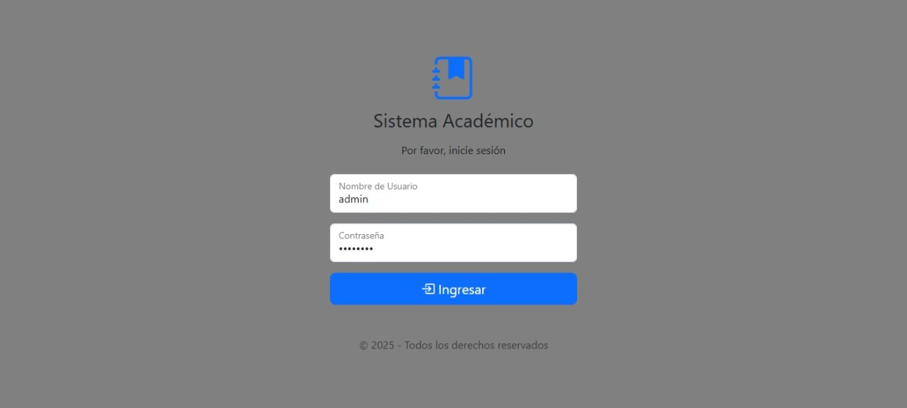
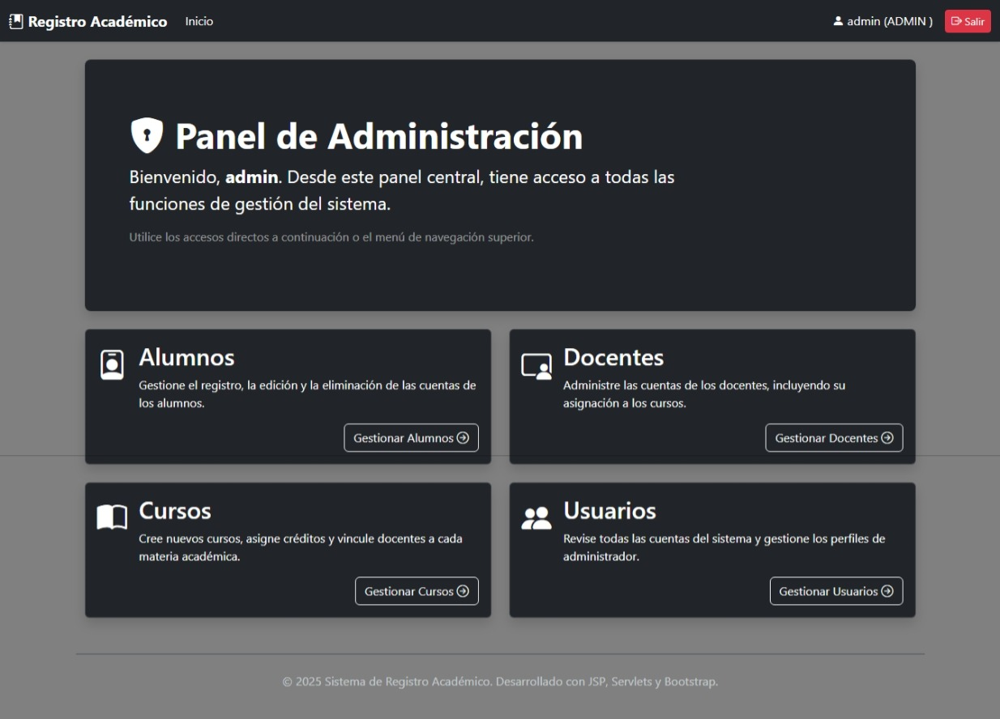

# Sistema de Gestión Académica (Java Web)

Este proyecto es un sistema de gestión académica desarrollado como una aplicación web en Java, utilizando Servlets para la lógica de negocio y JavaServer Pages (JSP) para la interfaz de usuario. Permite la administración de alumnos, docentes, cursos y usuarios, con funcionalidades de autenticación basada en roles y gestión de matrículas y notas.

### LOG IN


### PANEL ADMIN


Mas capturas de pantalla estan en la carpeta [screenshots](screenshots).

## Características

-   **Autenticación y Autorización:** Sistema de login con roles de usuario (Administrador, Docente, Alumno).
-   **Gestión de Usuarios:** CRUD (Crear, Leer, Actualizar, Eliminar) para alumnos, docentes y usuarios (administradores).
-   **Gestión de Cursos:** Creación y administración de cursos, incluyendo la asignación de docentes.
-   **Gestión de Matrículas:** Funcionalidad para que los alumnos se matriculen en cursos disponibles por período académico.
-   **Gestión de Notas:** Los docentes pueden gestionar las notas de los alumnos en sus cursos.
-   **Conexión a Base de Datos:** Utiliza JDBC para interactuar con una base de datos MySQL.
-   **Transacciones Seguras:** Implementación de transacciones para asegurar la integridad de los datos en operaciones complejas.

## Tecnologías Utilizadas

-   **Backend:** Java (Servlets, JDBC)
-   **Frontend:** JSP (JavaServer Pages), HTML, CSS, JavaScript, Bootstrap para el diseño.
-   **Base de Datos:** MySQL
-   **Servidor de Aplicaciones:** Compatible con cualquier servidor de aplicaciones Java (ej. Apache Tomcat)
-   **Librerías:** JSTL (JavaServer Pages Standard Tag Library), MySQL Connector/J

## Configuración del Entorno y Ejecución

Para configurar y ejecutar este proyecto, necesitarás tener instalado lo siguiente:

-   JDK (Java Development Kit) 8 o superior
-   Apache Tomcat 9 o superior (u otro servidor de aplicaciones Java compatible)
-   MySQL Server
-   Un IDE de desarrollo Java (ej. Eclipse, IntelliJ IDEA)

### 1. Configuración de la Base de Datos

1.  **Crear la Base de Datos y Tablas:**
    El script SQL para crear la base de datos y las tablas se encuentra en el directorio `bd-scripts/BD-registro-academico.sql`. Puedes ejecutar este script en tu servidor MySQL para configurar la base de datos `registro_academico` y todas sus tablas.

    El script completo se encuentra en [bd-scripts/BD-registro-academico.sql](bd-scripts/BD-registro-academico.sql).
    
  >  **Nota:** El script ya incluye la creación de la base de datos `registro_academico` y la inserción de roles y un usuario administrador de ejemplo.

1.  **Configurar Credenciales de Conexión:**
    Abre el archivo `src/main/java/db/MySQLConexion.java` y actualiza las credenciales de la base de datos si son diferentes a las predeterminadas.

    ```java
    // ...
    public class MySQLConexion {
        public static Connection getConexion() {
            Connection con = null;
            try {
                Class.forName("com.mysql.cj.jdbc.Driver");
                String url = "jdbc:mysql://localhost:3306/registro_academico?useSSL=false&useTimezone=true&serverTimezone=UTC";
                String usr = "TU USUARIO"; // <--- Tu usuario de MySQL
                String psw = "TU CONTRASEÑA"; // <--- Tu contraseña de MySQL
                con = DriverManager.getConnection(url, usr, psw);
            } catch (ClassNotFoundException e) {
                System.out.println("Error >> Driver no Instalado!!" + e.getMessage());
            }
            // ...
        }
        // ...
    }
    ```

### 2. Configuración del Proyecto en el IDE

1.  **Importar el Proyecto:**
    Importa el proyecto en tu IDE (Eclipse, IntelliJ IDEA) como un proyecto web dinámico o un proyecto Java existente.

    > **Notas:**
    >  - Los archivos `.classpath`, `.project`, `.settings/` y `.idea/` **no se versionan** ya que son configuraciones locales de cada IDE.
    >  - Si en algún momento necesitas esos archivos, puedes regenerarlos desde tu IDE al importar el proyecto.
    >  - Esto permite que el repositorio sea más limpio y que funcione tanto en Eclipse como en IntelliJ u otros editores.

    ### Importar en Eclipse

        1. Abre **Eclipse**.  
        2. Ve a `File > New > Dynamic Web Project`.
        3. Por defecto Eclipse quiere crearlo en su workspace.
        4. Debes desmarcar la opción **Use default location**.  
        5. Selecciona la carpeta donde clonaste el repositorio (proyecto-jdbc).  
        6. Finaliza y verifica que el proyecto aparece en el **Package Explorer**.

2.  **Añadir Librerías (JARs):**
    Asegúrate de que las siguientes librerías estén en el `Classpath` de tu proyecto (normalmente en `WEB-INF/lib`):
    -   `mysql-connector-java-8.0.30.jar` 
    -   `jstl-1.2.jar`
    -   `standard-1.1.2.jar`

    Si no están, descárgalas y añádelas manualmente a la carpeta `src/main/webapp/WEB-INF/lib` de tu proyecto y luego inclúyelas en el `Build Path` de tu IDE.

### 3. Despliegue en Apache Tomcat

 Para eso en Eclipse:
- Menú Window → Preferences → Server → Runtime Environments.
- Agregas una instalación de Tomcat (apuntas a la carpeta donde lo instalaste).
- Luego clic derecho a `login.jsp` → Run As → Run on Server.

Una vez que el servidor Tomcat esté en ejecución y la aplicación desplegada, podrás acceder a ella tambien a través de tu navegador web. La URL predeterminada será algo como:

```
http://localhost:8080/proyecto-jdbc/login.jsp
```

**Credenciales de Prueba:**
-   **Administrador:** `usuario: admin`, `contraseña: admin123`

## Estructura del Proyecto

```
src/
├── main/
│   ├── java/
│   │   ├── dao/                 # Interfaces para el acceso a datos
│   │   ├── db/                  # Clases de conexión a la base de datos
│   │   ├── entidades/           # Clases de modelo (POJOs)
│   │   ├── interfaces/          # Interfaces DAO
│   │   ├── modelos/             # Implementaciones DAO
│   │   ├── otros/               # Clases auxiliares
│   │   ├── servlet/             # Controladores (Servlets)
│   │   └── sesion/              # Gestión de sesión
│   └── webapp/                  # Contenido web (JSPs, recursos estáticos)
│       ├── admin/               # Páginas JSP para el rol de administrador
│       ├── alumno/              # Páginas JSP para el rol de alumno
│       ├── docente/             # Páginas JSP para el rol de docente
│       ├── includes/            # JSPs reusables (header, footer)
│       ├── META-INF/
│       ├── WEB-INF/             # Archivos de configuración web (web.xml, lib)
│       │   └── lib/             # Librerías JAR del proyecto
│       └── login.jsp            # Página de inicio de sesión
└── test/
```

## Contribuciones

Las contribuciones son bienvenidas. Si deseas mejorar este proyecto, por favor, sigue estos pasos:

1.  Haz un fork del repositorio.
2.  Crea una nueva rama (`git checkout -b feature/nueva-funcionalidad`).
3.  Realiza tus cambios y commitea (`git commit -am 'feat: Añadir nueva funcionalidad'`).
4.  Sube tus cambios (`git push origin feature/nueva-funcionalidad`).
5.  Abre un Pull Request.

## Licencia

Este proyecto está bajo la Licencia MIT. Consulta el archivo `LICENSE` para más detalles.

---

**Nota:** Este proyecto es un ejemplo básico y puede requerir mejoras adicionales en seguridad (ej. hashing de contraseñas más robusto), manejo de errores, validación de entrada y uso de herramientas de construcción como Maven/Gradle para un entorno de producción.

